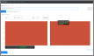

# Standalone Prometheus exporter for Comet Server

[](https://twitter.com/CometBackup)

This exporter serves a Prometheus-compatible `/metrics/` endpoint. It pulls information from a Comet Server on-demand.

[](doc/screenshot.png)

This exporter is made available under the terms of the MIT license. You are free to use and modify this script for any purpose as long as you retain the copyright notice in the `LICENSE` file and/or elsewhere in this repository.

## Installing

### Running the exporter (Docker)

```bash
# Build Docker image
docker build . -t comet-prometheus-exporter:latest

# Run container instance against target Comet Server
docker run -d --restart=always -e COMET_SERVER_URL="http://127.0.0.1/" -e COMET_ADMIN_USER="admin" -e COMET_ADMIN_PASS="admin" -p 80:80 comet-prometheus-exporter:latest
```

### Running the exporter (without Docker)

1. Install necessary dependencies
    - `php`, `php-curl`
2. Configure web server to host `/wwwroot` directory
3. Configure web server to set configuration environment variables

### Adding to Prometheus

Add the exporter's URL to `prometheus.yml` in the `scrape_configs` > `static_configs` > `targets` array.

## Developing

### Developing with Docker

To develop the exporter, run a development container that bind-mounts your Git checkout directory:

```bash
# Replace /c/repos/comet-prometheus-exporter/ with the path to your Git checkout
docker run --rm \
    -v /c/repos/comet-prometheus-exporter/approot:/approot \
    -e COMET_SERVER_URL="http://127.0.0.1/" \
    -e COMET_ADMIN_USER="admin" \
    -e COMET_ADMIN_PASS="admin" \
    -p 12000:80 \
    comet-prometheus-exporter:latest
```

You can then visit the development instance in a web browser on http://127.0.0.1:12000/metrics/ for development and troubleshooting.

### Submitting your changes (Optional)

If you've made a change to the exporter that you think would be useful for other partners too, we'd love to incorporate it - please submit a [pull request on GitHub](https://github.com/CometBackup/comet-prometheus-exporter/pulls) or send your modifications via the [CometBackup.com](https://cometbackup.com/) ticket system.

## Metrics

This exporter produces the following metrics:

### Meta

- `cometserver_api_lookup_duration` (Gauge)
    - The time required to retrieve data from the Comet Server (ms)
- `cometserver_users_total` (Gauge)
    - Total number of users on this Comet Server
- `cometserver_recentjobs_total` (Gauge)
    - Labels: `status`
    - Total number of jobs in the last 24 hours

### Per-device

- `cometserver_device_is_current` (Gauge)
    - Labels: `username`, `device_id`, `device_name`
    - Whether each online device is running the current software version (x.x.x)
- `cometserver_device_is_online` (Gauge)
    - Labels: `username`, `device_id`, `device_name`
    - The online/offline status of each registered device

### Last backup job

- `cometserver_lastbackup_download_size_bytes` (Gauge)
    - Labels: `username`, `protected_item_id`, `protected_item_name`, `device_id`, `device_name`
    - The size (bytes) downloaded during most recent completed backup job for this Protected Item
- `cometserver_lastbackup_end_time` (Gauge)
    - Labels: `username`, `protected_item_id`, `protected_item_name`, `device_id`, `device_name`
    - The end time of the most recent completed backup job for this Protected Item
- `cometserver_lastbackup_file_count` (Gauge)
    - Labels: `username`, `protected_item_id`, `protected_item_name`, `device_id`, `device_name`
    - The number of files in the most recent completed backup job for this Protected Item
- `cometserver_lastbackup_file_size_bytes` (Gauge)
    - Labels: `username` `protected_item_id`, `protected_item_name`, `device_id`, `device_name`
    - The size (bytes) of the data selected for backup on disk, as of the most recent completed backup job for this Protected Item
- `cometserver_lastbackup_status` (Gauge)
    - Labels: `username`, `protected_item_id`, `protected_item_name`, `device_id`, `device_name`, `status`
    - The status of the most recent completed backup job for this Protected Item
- `cometserver_lastbackup_start_time` (Gauge)
    - Labels: `username`, `protected_item_id`, `protected_item_name`, `device_id`, `device_name`
    - The start time of the most recent completed backup job for this Protected Item
- `cometserver_lastbackup_upload_size_bytes` (Gauge)
    - Labels: `username`, `protected_item_id`, `protected_item_name`, `device_id`, `device_name`
    - The size (bytes) uploaded during most recent completed backup job for this Protected Item

### Per-Storage Vault

- `cometserver_storagevault_size_bytes` (Gauge)
    - Labels: `username`, `vault_id`, `vault_name`, `vault_type`
    - The last measured size (in bytes) of each Storage Vault
- `cometserver_storagevault_quota_bytes` (Gauge)
    - Labels: `username`, `vault_id`, `vault_name`, `vault_type`
    - The quota limit for each Storage Vault, if one is set
